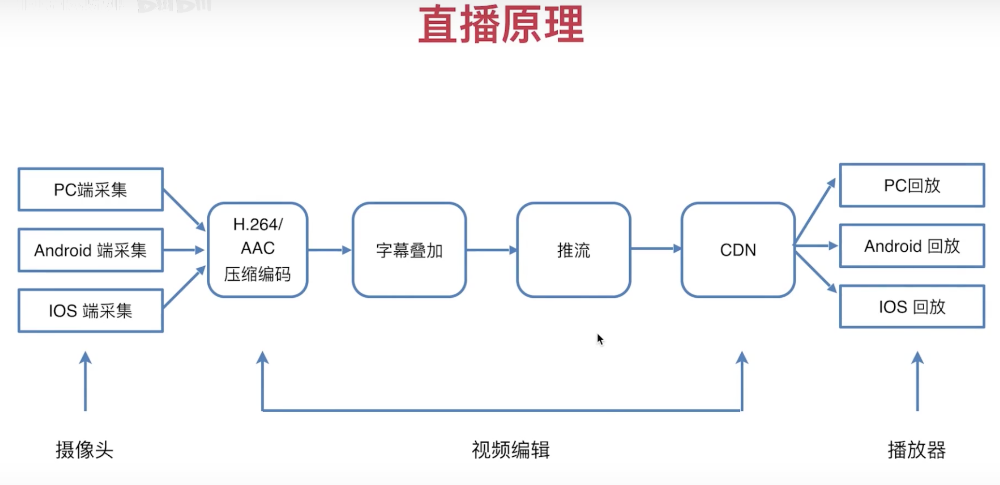
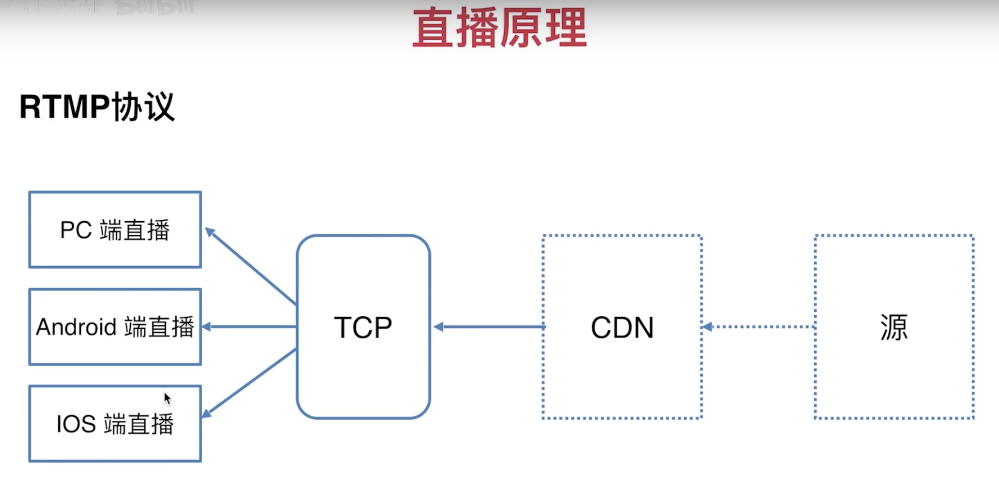
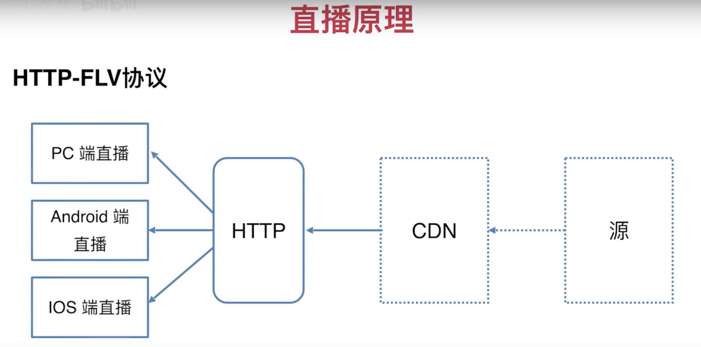

# H5直播

## 原理

### 点播与直播

> 点播

```
我们常见的视频网站，爱奇艺，优酷等，在上面看得大部分电影、电视剧都是属于点播
```

> 直播

```
在斗鱼、虎牙上看的大部分是直播
```

> 图解



## 编码

### 视频

H264

### 音频

AAC

## 协议

参考：https://blog.csdn.net/Ricardo18/article/details/89359623

### HLS协议【苹果公司开发的】


```
特点：
	好用，但是有一定的延迟，不需要创建长连接，传输文件是ts文件

应用场景：
	苹果公司
	延时要求不高、斗鱼直播、熊猫TV（播放的时候）
```

### RTMP协议



```
特点：
	实时性比较好，但是使用起来比较复杂
	
应用场景：
	采集端使用客户端来做的（iOS、Android）
	低延时
```

### HTTP-FLV协议



```
特点：
	集合 hls 和 rtmp 的优点，但是支持的格式是flv
	
应用场景：
	B站、低延时
```

## Video

### Video常见属性

> HMTL

```html
<video controlslist="nodownload"/> 不显示下载
<video controlslist="nofullscreen"/> 不全屏 
<video controlslist="nofullscreen"/> 不全屏 
<video poster="xxx.jpg"/> 贴图
<video autoplay/> 自动播放
<video muted/> 静音
<video loop/> 循环播放
<video preload/> 预加载

<!-- 备用地址 -->
<video id="myVideo" width="400" height="225" controls>
  <source src=".test.mp4" type="video/mp4" />
  <source src="https://v-cdn.zjol.com.cn/276986.mp4" type="video/mp4" />
</video>
```

> JAVASCRIPT

```js
var video = document.getElementById('myVideo')
video.volume = 0.5 // 音量
video.currentTime = 60 // 设置当前时间(单位：秒)
video.src = "" // 设置新地址
video.currentSrc // 获取当前播放地址
video.duration // 获取视频总时长(必须等视频加载完元信息时才能拿到)
video.paused // 判断当前播放状态是否是暂停状态
```

### Video常见事件

```js
video.addEventListener('事件',e => {
	
})

loadstart  // 视频开始加载
durationchange // 总时长变化
loadedmetadata // 元信息加载完毕
loadeddata // 没有足够的视频、音频帧去播放
progress // 视频、音频在下载数据
canplay // 可以播放了
canplaythrough // 有足够的视频帧播放了
play // 播放
pause // 暂停
seeking // 开始寻址
seeked // 结束寻址
waiting // 等待
playing // 播放中
timeupdate // 播放时间更新(自定义进度条需要用到)
ended // 结束
error // 出错
```

### Video常见方法

```js
var video = document.getElementById('myVideo')

video.play() // 播放
video.pause() // 暂停
```

## 直播源制作

### Nginx + ffmpeg

> 1、安装Nginx

```bash
Mac系统：
brew tap denji/nginx
brew install nginx-full --with-rtmp-module

启动：nginx
停止：nginx -s stop
验证：http://localhost:8080
```

> 2、安装ffmpeg

```bash
Mac系统：
brew install ffmpeg

验证：ffmpeg
```

> 3、配置Nginx

```nginx
# 更多配置请参考：https://blog.csdn.net/Ricardo18/article/details/89359623
server {
        listen       8080;
        server_name  localhost;

        #charset koi8-r;

        #access_log  logs/host.access.log  main;

        location / {
            root   html;
            index  index.html index.htm;
        }

        location /hls {
            types {
                application/vnd.apple.mpegurl m3u8;
                video/mp2t ts;
            }
            root /usr/local/var/www;
            add_header Cache-Control no-cache;
        }
}

rtmp {
    server {
        listen 3008;
        chunk_size 4000;

        # RTMP 直播流配置
        application rtmplive {
            live on;
            max_connections 1024;
        }

        # hls 直播流配置
        application hls {
            live on;
            hls on;
            hls_path /usr/local/var/www/hls;
            hls_fragment 5s;
        }
    }
}
```

> 4、准备视频

```
准备一个普通的mp4视频即可
```

> 5、利用ffmpeg推流【切换到上一步mp4所在的目录】

```shell
# 推 rtmp 流
ffmpeg -re -i test.mp4 -vcodec libx264 -acodec aac -f flv rtmp://localhost:3008/rtmplive/rtmp

# 推 hls 流
ffmpeg -re -i test.mp4 -vcodec libx264 -acodec aac -f flv rtmp://localhost:3008/hls/stream
```

> 6、测试

```bash
# 测试 rtmp
打开vlc播放器，然后 File > Open Network 在地址栏中输入 rtmp://localhost:3008/rtmplive/rtmp

# 测试 hls
打开Safari浏览器，在地址栏目中输入 http://localhost:8080/hls/stream.m3u8 然后按回车
```

## 可用线上直播流

> HLS直播流

```
http://stream.mastvnet.com/MASTV/sd/live.m3u8
```

> FLS直播流

```
http://211.73.19.201/live/E6290DC0-BE6A-B7C4-79F5-114BDB417F9E?fmt=x264_500K_ts&cpid=admin&size=1280X720&toflv=15
```

## 实战

### video.js实战

```bash
# 适合做直播、点播

# 使用参考
https://github.com/videojs/video.js
https://docs.videojs.com/docs/api/video.html

# 直播（hls）
https://videojs.com/plugins
https://www.npmjs.com/package/videojs-contrib-hls#getting-started
```

### hls.js实战

```bash
# 适合做hls类型的直播、点播

# 使用参考
https://github.com/video-dev/hls.js
```

### flv.js 实战

```bash
# B站开源的flv播放器
```

### 微信小程序实战

```bash
# 注意点
1、必须先获取权限，开通实时播放音视频流、实时录制音视频流
2、目前小程序只支持 flv, rtmp 格式
3、必须要真机调试才能看到效果

# 使用参考
https://developers.weixin.qq.com/miniprogram/dev/component/live-player.html
https://developers.weixin.qq.com/miniprogram/dev/component/live-pusher.html
```

